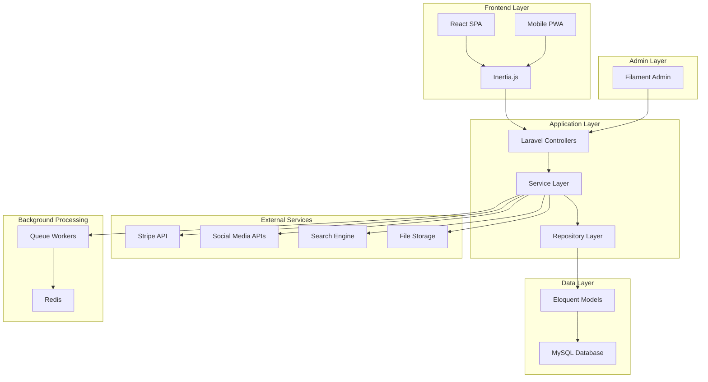
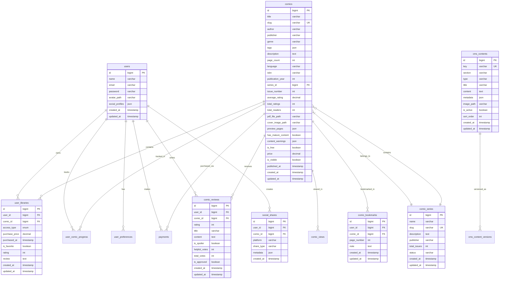

# Design Document

## Overview

The comprehensive comic book platform will be built upon the existing Laravel + React + Inertia.js architecture, leveraging Filament for admin functionality and Stripe for payments. The platform will provide a complete ecosystem for comic book discovery, purchase, reading, and social interaction while maintaining a robust CMS for content management.

### Technology Stack
- **Backend**: Laravel 12 with PHP 8.2+
- **Frontend**: React 19 with TypeScript and Tailwind CSS
- **Admin Panel**: Filament 3.3
- **Database**: MySQL/PostgreSQL with Eloquent ORM
- **Payments**: Stripe with Laravel Cashier
- **PDF Processing**: PDF.js for comic reading
- **File Storage**: Laravel Storage with S3 compatibility
- **Real-time Features**: Laravel Broadcasting with Pusher
- **Search**: Laravel Scout with Algolia/Meilisearch
- **Caching**: Redis for session and application caching

## Architecture

### System Architecture



### Database Schema Design



## Components and Interfaces

### Backend Components

#### 1. Comic Management Service
```php
interface ComicServiceInterface
{
    public function createComic(array $data, UploadedFile $pdfFile, ?UploadedFile $coverImage): Comic;
    public function updateComic(Comic $comic, array $data): Comic;
    public function processComicFile(UploadedFile $file): array;
    public function extractMetadata(string $filePath): array;
    public function generatePreviewPages(string $filePath, int $count = 5): array;
    public function searchComics(array $filters, array $sort = []): Collection;
}
```

#### 2. User Library Service
```php
interface UserLibraryServiceInterface
{
    public function addToLibrary(User $user, Comic $comic, string $accessType, ?float $price = null): UserLibrary;
    public function removeFromLibrary(User $user, Comic $comic): bool;
    public function getUserLibrary(User $user, array $filters = []): Collection;
    public function markAsFavorite(User $user, Comic $comic): void;
    public function rateComic(User $user, Comic $comic, int $rating, ?string $review = null): void;
}
```

#### 3. Reading Progress Service
```php
interface ReadingProgressServiceInterface
{
    public function updateProgress(User $user, Comic $comic, int $currentPage, ?array $metadata = null): UserComicProgress;
    public function getProgress(User $user, Comic $comic): ?UserComicProgress;
    public function addBookmark(User $user, Comic $comic, int $page, ?string $note = null): ComicBookmark;
    public function getBookmarks(User $user, Comic $comic): Collection;
}
```

#### 4. Social Features Service
```php
interface SocialServiceInterface
{
    public function shareToSocialMedia(User $user, Comic $comic, string $platform, array $options = []): SocialShare;
    public function getReviews(Comic $comic, array $filters = []): Collection;
    public function submitReview(User $user, Comic $comic, array $reviewData): ComicReview;
    public function voteOnReview(User $user, ComicReview $review, bool $helpful): void;
}
```

#### 5. Payment Service
```php
interface PaymentServiceInterface
{
    public function createPaymentIntent(User $user, Comic $comic): PaymentIntent;
    public function processPayment(User $user, string $paymentIntentId): Payment;
    public function refundPayment(Payment $payment, ?float $amount = null): Refund;
    public function getUserPaymentHistory(User $user): Collection;
}
```

#### 6. CMS Service
```php
interface CmsServiceInterface
{
    public function getContent(string $key, ?string $section = null): ?CmsContent;
    public function updateContent(string $key, array $data): CmsContent;
    public function createContent(array $data): CmsContent;
    public function getContentBySection(string $section): Collection;
    public function publishContent(CmsContent $content): void;
}
```

### Frontend Components

#### 1. Comic Discovery Components
- `ComicGrid`: Responsive grid layout for comic display
- `ComicCard`: Individual comic card with cover, title, rating, and actions
- `FilterSidebar`: Advanced filtering interface
- `SearchBar`: Real-time search with suggestions
- `SortDropdown`: Sorting options for results

#### 2. Reading Experience Components
- `ComicReader`: Full-screen PDF reader with navigation
- `ReaderControls`: Zoom, navigation, and settings controls
- `BookmarkPanel`: Bookmark management interface
- `ProgressTracker`: Reading progress visualization
- `ReaderSettings`: Customizable reading preferences

#### 3. Social Features Components
- `ReviewSection`: Display and submission of reviews
- `RatingStars`: Interactive star rating component
- `SocialShareButtons`: Social media sharing interface
- `UserProfile`: User profile with reading statistics
- `RecommendationEngine`: Personalized comic recommendations

#### 4. Library Management Components
- `UserLibrary`: Personal comic library interface
- `LibraryFilters`: Library-specific filtering options
- `ReadingHistory`: Reading progress and history
- `FavoritesList`: Favorite comics management
- `PurchaseHistory`: Payment and purchase tracking

#### 5. Admin CMS Components
- `ContentEditor`: WYSIWYG editor for page content
- `MediaManager`: File and image management
- `ComicUploader`: Bulk comic upload interface
- `UserManager`: User account management
- `AnalyticsDashboard`: Platform analytics and reporting

## Data Models

### Enhanced Models

#### Comic Model Extensions
```php
// Additional relationships and methods
public function series(): BelongsTo;
public function reviews(): HasMany;
public function bookmarks(): HasMany;
public function socialShares(): HasMany;
public function getRecommendedComics(int $limit = 10): Collection;
public function getSimilarComics(int $limit = 5): Collection;
```

#### User Model Extensions
```php
// Additional relationships and methods
public function reviews(): HasMany;
public function bookmarks(): HasMany;
public function socialShares(): HasMany;
public function getReadingStatistics(): array;
public function getRecommendations(int $limit = 10): Collection;
```

#### New Models

##### ComicSeries Model
```php
class ComicSeries extends Model
{
    protected $fillable = ['name', 'slug', 'description', 'publisher', 'status'];
    
    public function comics(): HasMany;
    public function getLatestIssue(): ?Comic;
    public function getTotalIssues(): int;
}
```

##### ComicReview Model
```php
class ComicReview extends Model
{
    protected $fillable = ['user_id', 'comic_id', 'rating', 'title', 'content', 'is_spoiler'];
    
    public function user(): BelongsTo;
    public function comic(): BelongsTo;
    public function votes(): HasMany;
    public function getHelpfulnessRatio(): float;
}
```

##### ComicBookmark Model
```php
class ComicBookmark extends Model
{
    protected $fillable = ['user_id', 'comic_id', 'page_number', 'note'];
    
    public function user(): BelongsTo;
    public function comic(): BelongsTo;
}
```

##### SocialShare Model
```php
class SocialShare extends Model
{
    protected $fillable = ['user_id', 'comic_id', 'platform', 'share_type', 'metadata'];
    protected $casts = ['metadata' => 'array'];
    
    public function user(): BelongsTo;
    public function comic(): BelongsTo;
}
```

## Error Handling

### API Error Responses
```php
// Standardized error response format
{
    "success": false,
    "error": {
        "code": "COMIC_NOT_FOUND",
        "message": "The requested comic could not be found",
        "details": {
            "comic_id": 123,
            "user_id": 456
        }
    },
    "timestamp": "2025-08-04T12:00:00Z"
}
```

### Error Categories
1. **Authentication Errors**: Invalid credentials, expired tokens
2. **Authorization Errors**: Insufficient permissions, access denied
3. **Validation Errors**: Invalid input data, missing required fields
4. **Business Logic Errors**: Payment failures, content restrictions
5. **System Errors**: Database failures, external service unavailability

### Error Handling Strategy
- **Frontend**: Global error boundary with user-friendly messages
- **Backend**: Centralized exception handling with logging
- **Payment Errors**: Graceful degradation with retry mechanisms
- **File Upload Errors**: Progress tracking with error recovery
- **Network Errors**: Offline support with sync capabilities

## Testing Strategy

### Backend Testing
1. **Unit Tests**: Service classes, model methods, utilities
2. **Feature Tests**: API endpoints, user workflows, payment processing
3. **Integration Tests**: External service interactions, file processing
4. **Performance Tests**: Database queries, file upload/download speeds

### Frontend Testing
1. **Component Tests**: Individual React components with React Testing Library
2. **Integration Tests**: User workflows, form submissions, navigation
3. **E2E Tests**: Complete user journeys with Playwright
4. **Visual Regression Tests**: UI consistency across devices

### Test Coverage Goals
- Backend: 90% code coverage
- Frontend: 85% component coverage
- Critical paths: 100% coverage (payments, user authentication, content access)

### Testing Infrastructure
- **CI/CD**: GitHub Actions with automated test runs
- **Test Databases**: Separate test database with seeded data
- **Mock Services**: External API mocking for reliable tests
- **Performance Monitoring**: Automated performance regression detection

### Security Testing
1. **Authentication Testing**: Login/logout, session management
2. **Authorization Testing**: Access control, permission boundaries
3. **Input Validation**: SQL injection, XSS prevention
4. **File Upload Security**: Malicious file detection, size limits
5. **Payment Security**: PCI compliance, secure token handling

### Accessibility Testing
1. **Screen Reader Compatibility**: ARIA labels, semantic HTML
2. **Keyboard Navigation**: Tab order, focus management
3. **Color Contrast**: WCAG 2.1 AA compliance
4. **Mobile Accessibility**: Touch targets, responsive design
5. **Automated Testing**: axe-core integration for continuous monitoring